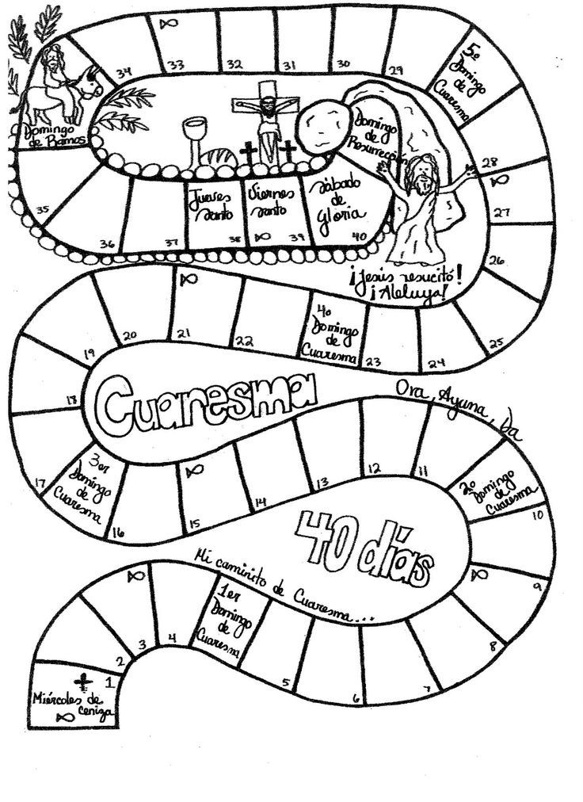

# Cuaresma





* Tiempo especial para preparar la Pascua, la gran fiesta cristiana que celebra la muerte y la resurrección de Jesús.
* La palabra Cuaresma viene de la palabra latina cuadragesima.
* Indica los cuarenta días que Jesús pasó en el desierto donde fue tentado por Satanás
* Recuerda los cuarenta años que el pueblo de Israel pasó en el desierto en camino hacia la Tierra prometida
* Comienza el miércoles de Ceniza y termina el Domingo de Ramos, antes de la Semana Santa.

## El Carnaval y el Miércoles de Ceniza

* El **Carnaval** se celebra el día anterior al Miércoles de Ceniza. Es una tradición festejar antes de comenzar la Cuaresma.
* Como indica el símbolo de las **Cenizas,** cada uno de nosotros es invitado a reconocer que somos seres mortales y, como tal, tenemos que prepararnos para un día entrar en la Vida eterna.
* La Cuaresma nos ayuda a convertir nuestro corazón, y a cambiar de vida: dejar todo lo que nos aleja de Dios, el pecado, y seguir la invitación de Dios a una vida nueva.

## Tres palabras / actitudes principales de la Cuaresma

* Oración. Es un tiempo para el encuentro con Dios en la oración y el silencio.
* Ayuno / Penitencia. Es un tiempo para dejar todo para seguir a Jesús y estar dispuesto al sacrificio tal como Él.
* Esmola / Caridad. Es un tiempo para señales de atención a los demás a nuestro alrededor, olvidándonos de nosotros mismos y compartir nuestros bienes materiales y el tiempo con los que más lo necesitan.

## Domingo de Ramos, Semana Santa y Pascua

* El Domingo de Ramos es el último día de la Cuaresma en que se recuerda la entrada de Jesús en Jerusalén, ciudad donde se va a entregar por nosotros.
* La Semana Santa son los días que preceden a la Pascua, de lunes a viernes
* El Triduo Pascual son tres días especiales que comienzan el Jueves donde se celebra la Última Cena, en la Sexta la muerte de Jesús y el sábado el día anterior a la Resurrección, generalmente en una Misa en el alba de Domingo, la Vigilia Pascual.

## Atención: Cada uno debe elegir su propósito para la Cuaresma !!!

